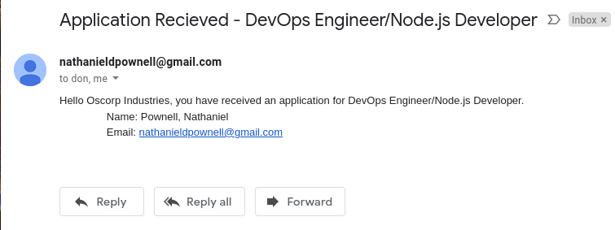

## Job Posting CRUD Platform 
### Python/Django - Html/TailwindCSS

A project that allows users to post and apply to jobs, edit jobs, and edit their company and user profiles.

This project was created over the course of one week. Development began with some whiteboarding on Figma - planning out the project was vital if I was going to complete it on time. 

*As you can see, I was originally going to use React for the front end. I decided not to, to keep things simpler.*

Once I had the application planned out, I created the backend portion as specified.

After the backend was *mostly* done I began working on the front end. I decided to use Tailwind to style the UI to save time. 

Here's the homepage. Fairly simple: Navbar, hero, search bar, and list of open positions.

On the job details, you may read about the position and view the company that posted the job.

At the bottom of the listing there are clickable tags to view other jobs with the same tag, and the *apply* button.

Clicking the apply directs you to the success page after triggering the `send_mail()` function in the backend.

`send_mail()` Sends an alert email to the job poster, and a confirmation email to the applicant, shown below.

Sent to employer/job poster...

Sent to applicant.

Posting a job.

The employer can view and edit their profile from this view. They may also view, edit, and delete their job postings.

The job applicant can view and edit their profile from this view. 

Here you can see the result of searching for "python".